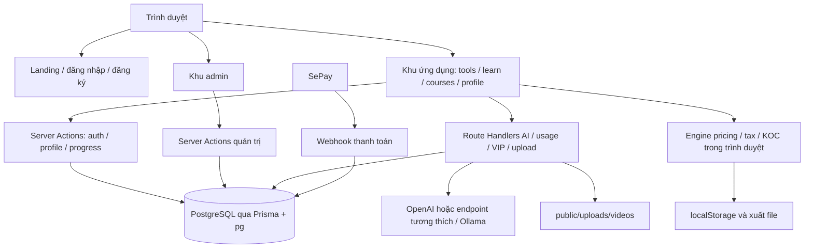
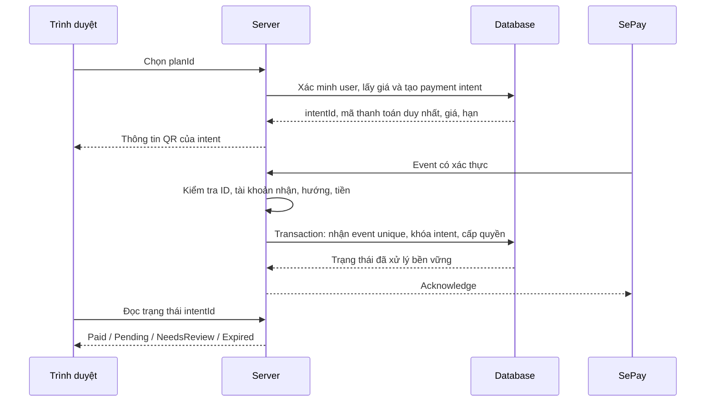
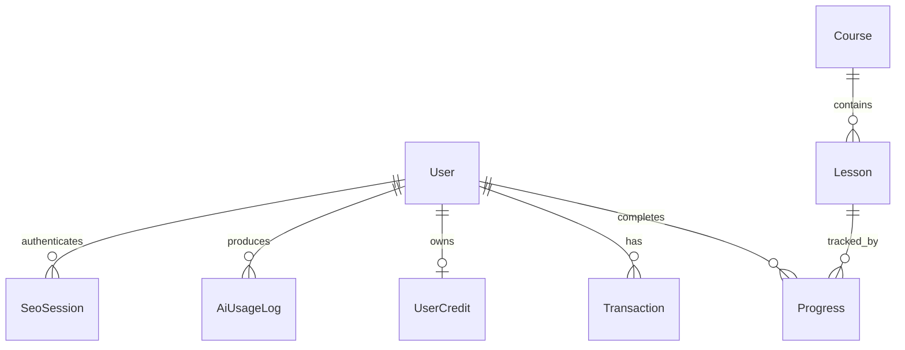
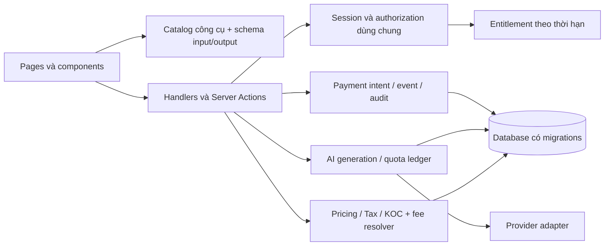

# Phân tích chuyên sâu dự án AIChoShop

## 1. Đánh giá tổng thể

AIChoShop là ứng dụng web hỗ trợ người bán hàng thương mại điện tử, kết hợp bộ công cụ tạo nội dung, mô hình tính toán tài chính, khóa học và bán quyền truy cập VIP. Dự án đã vượt qua giai đoạn giao diện mẫu đơn thuần: có nghiệp vụ tính giá, thuế, KOC; có lưu tiến độ học; có cấu hình AI và webhook thanh toán. Tuy nhiên, cơ chế bảo vệ tài khoản, dữ liệu trả phí và thanh toán chưa đủ chặt để vận hành công khai với dữ liệu và tiền thật.

**Đánh giá mức trưởng thành: MVP có phạm vi chức năng rộng, cần củng cố nền tảng trước khi mở rộng.** Đây là nhận định kỹ thuật từ mã nguồn, không phải đánh giá doanh thu, số khách hàng hay chất lượng hệ thống đang triển khai. Chưa có dữ liệu vận hành để kết luận sản phẩm đã đạt sự phù hợp thị trường.

Giá trị đáng giữ lại nằm ở việc sắp xếp công cụ theo công việc của seller, các bộ tính toán tách khỏi giao diện, cấu trúc SEO có kiểm tra đầu vào/đầu ra, và quan hệ giữa công cụ với nội dung đào tạo. Hạn chế lớn nhất là cùng một khái niệm như “đăng nhập”, “VIP”, “lượt AI”, “thanh toán thành công” đang được thực hiện khác nhau ở nhiều nơi.

Không cần viết lại toàn bộ ứng dụng. Hướng phù hợp là giữ Next.js và các engine tính toán, xây lại lớp xác thực/phân quyền và vòng đời thanh toán; sau đó thống nhất quota, lưu trữ, giao diện và kiểm thử.

| Mặt đánh giá | Hiện trạng | Ý nghĩa |
|---|---|---|
| Phạm vi sản phẩm | 11 công cụ, khóa học, tài khoản, quản trị, VIP | Đã có nền tảng để thử nghiệm nhu cầu |
| Tính toán nghiệp vụ | Có engine riêng và test | Có thể nâng chất lượng từng phần mà không thay UI toàn bộ |
| AI | 8 luồng sinh văn bản; SEO có hợp đồng dữ liệu riêng | Chất lượng kiểm soát không đồng đều giữa các công cụ |
| Xác thực/phân quyền | Cookie admin cố định, cookie user là ID; nhiều API thiếu kiểm tra | Cản trở phát hành công khai |
| Thanh toán | Có tích hợp, nhưng nhận dạng, chống trùng và ghi nhận chưa an toàn | Có thể cấp sai quyền hoặc ghi nhận sai giao dịch |
| Trải nghiệm | Nhiều màn hình chi tiết; dữ liệu mẫu và quyền dùng chưa nhất quán | Dễ gây hiểu nhầm và tăng chi phí hỗ trợ |
| Vận hành | Có lockfile; thiếu migration có phiên bản, CI và quy trình release trong repo | Khó chứng minh khả năng dựng lại và phục hồi hệ thống |

## 2. Phạm vi, bằng chứng và giới hạn

Ảnh chụp mã được đối chiếu tại Git HEAD `627f099`, ngày kiểm tra 14/09/2026. Trong phạm vi `src`, danh mục tĩnh gồm **120 file TS/TSX/CSS, 36.792 dòng**, trong đó có **28 page, 8 Route Handler, 27 file dưới components và 48 module khai báo `use client`**. Những con số này không bao gồm thư viện cài đặt, mã sinh `.next`, các skill, video hoặc dữ liệu biểu phí JSON.

Toàn bộ 120 file được quét cấu trúc cú pháp, import, hàm, liên kết và điểm gọi dữ liệu. Việc đọc sâu tập trung vào luồng thực thi, giao diện chứa nghiệp vụ, các đường truy cập dữ liệu và các phát hiện được trình bày bên dưới. Đây không phải tuyên bố đã kiểm tra trực quan từng màn hình hay đọc thủ công từng dòng CSS. Danh mục từng file nằm trong [bản đồ mã nguồn](/D:/AIChoShop/docs/ban-do-ma-nguon.md).

Ba mức bằng chứng được sử dụng:

- **Đã xác nhận từ mã:** điều kiện, truy vấn hoặc đường dữ liệu thấy trực tiếp trong snapshot.
- **Đã tái hiện cô lập:** gọi mã thực với database, cookie, AI hoặc filesystem giả lập để chứng minh một nhánh hành vi. Không tương đương kiểm thử HTTP qua toàn bộ Next.js/proxy của môi trường triển khai.
- **Cần kiểm chứng vận hành:** tốc độ, bộ nhớ, UI responsive thực tế, dữ liệu production, pháp lý chuyên biệt và tích hợp bên ngoài.

| Kiểm tra | Kết quả | Giới hạn |
|---|---|---|
| Test có sẵn của pricing, SEO, KOC, thuế | 30/30 đạt | Các ca hiện có không bao phủ toàn bộ nghiệp vụ/phân quyền |
| ESLint baseline trước khi thêm các file phân tích | 166 lỗi, 170 cảnh báo trên 130 file | Có cả script/scratch; không đồng nghĩa 166 lỗi chạy thực tế |
| TypeScript theo tsconfig hiện tại | Lỗi ở `.next/types` tham chiếu route title-spinner không tồn tại | Chưa tái sinh `.next`; không kết luận source có lỗi type tương ứng |
| TypeScript bỏ các root file sinh trong `.next` | 123 root file, 0 diagnostic | Không thay thế kiểm tra build production |
| Mô phỏng các nhánh nhạy cảm | 9/9 hành vi nghi vấn được xác nhận | Mock không kiểm tra reverse proxy, middleware end-to-end hoặc DB thật |
| Thăm dò tính toán | Xác nhận thiếu nhánh thuế doanh nghiệp nhỏ; gợi ý ngành sai khi không có tín hiệu | Chưa đối chiếu mọi dòng biểu phí hoặc mọi tình huống thuế |

Chưa thực hiện: build production mới, đăng nhập/duyệt UI trực tiếp, tải thử video thật, gọi model thật, chuyển tiền, mutation database thật, kiểm thử tải, quét dependency advisory toàn diện và đánh giá khả năng khôi phục backup. Các đánh giá an toàn ở đây không dựa vào khai thác hệ thống đang chạy.

## 3. Kiến trúc hiện tại

Ứng dụng là một monolith Next.js App Router. Trang công khai, khu người dùng và khu admin chung mã nguồn, runtime và database. Không thấy backend riêng, hàng đợi công việc, kho tài liệu tìm kiếm, đồng bộ shop hoặc dịch vụ xử lý video trong mã ứng dụng.

### 3.1 Công nghệ và cách tổ chức

[package.json](/D:/AIChoShop/package.json) khai báo Next.js 16.3.4, React 19.2.8, TypeScript, Tailwind CSS 4, Prisma 7.10, `@prisma/adapter-pg`, OpenAI SDK, Motion, Lucide và SheetJS. Có `package-lock.json` được Git theo dõi.

`src/app/(app)` tạo bố cục chung cho khu người dùng; `src/app/admin` là khu quản trị; `src/app/api` chứa endpoint công khai; `src/lib` chứa phần nghiệp vụ và truy cập dữ liệu. Các file Supabase client/server tồn tại, nhưng quét import chưa tìm thấy đường sử dụng chúng từ ứng dụng. Không nên suy ra ứng dụng đang dùng Supabase Auth chỉ vì có dependency Supabase.

[prisma7.config.ts](/D:/AIChoShop/prisma7.config.ts) **không phải tên file lỗi** trong phiên bản thư viện đã cài: bộ nạp cấu hình tại `node_modules/@prisma/config/dist/index.js` có danh sách `prisma7.config.*`. Đây là ví dụ cần đối chiếu phiên bản thực tế thay vì đổi tên theo thói quen.

`src/middleware.ts` vẫn sử dụng quy ước middleware. Tài liệu đi kèm Next.js hiện tại đánh dấu tên này đã deprecated và chuyển sang proxy; đó là công việc bảo trì, không phải nguyên nhân của lỗi xác thực. Thay tên file mà giữ cách kiểm tra cookie cũ sẽ không giải quyết rủi ro.

### 3.2 Ranh giới trách nhiệm

Phần engine tính toán được tách tốt hơn phần điều phối ứng dụng. Ngược lại, route AI chung gộp cấu hình provider, xác thực, quota, prompt cho nhiều công cụ, gọi model, log và chuyển đổi lỗi trong gần 600 dòng. Nhiều component lớn chứa cả form, parser, lịch sử, export, biểu đồ và modal.

Có **8 file dài hơn 1.000 dòng**. Ví dụ: KOC page 2.058 dòng; PricingCalculatorClient 1.918; ProfileClient 1.595; UsersManager 1.591; LessonsManager 1.400. Độ dài không tự nó chứng minh lỗi, nhưng kết hợp với chính sách lặp lại và parser riêng cho từng output làm thay đổi xuyên suốt hệ thống tốn công và dễ thiếu điểm cập nhật.

### 3.3 Bản đồ HTTP API

| Endpoint | Method | Vai trò hiện tại | Kiểm soát tại handler |
|---|---|---|---|
| `/api/ai` | POST | 7 công cụ văn bản và chuyển tiếp SEO legacy | Cookie ID nếu có; đếm usage; chưa enforce VIP/guest quota; JSON đọc trực tiếp |
| `/api/ai/seo` | POST | SEO có cấu trúc | Content-Type, body 32 KB, validator, session/legacy/visitor, reservation |
| `/api/ai/usage` | GET, POST | Thống kê và ghi lịch sử | GET kiểm tra user/locked qua ID; POST chỉ kiểm tra cookie và tool rồi ghi |
| `/api/settings/openai` | GET, POST | Đọc/ghi provider/key/model | Không có session/role check |
| `/api/vip-plans` | GET, POST | Đọc gói và tạo gói | Không có session/role check; GET có tùy chọn all |
| `/api/vip-plans/[id]` | GET, PUT, PATCH, DELETE | Đọc/sửa/bật tắt/xóa gói | Không có session/role check |
| `/api/upload/video` | POST | Nhận multipart, ghi video | Chỉ kiểm tra có file và đuôi file |
| `/api/webhooks/sepay` | GET, POST | Health/ping và nhận tiền | Key tùy chọn, số tiền dương, nhận dạng user, cấp VIP |

Hai đường vào SEO dùng chung handler nhưng không cùng lớp đọc body: route legacy `/api/ai` đọc JSON trước khi chuyển tiếp, không hưởng giới hạn stream 32 KB của route SEO riêng. Cần bảo đảm endpoint tương thích không bỏ qua các giới hạn tài nguyên của endpoint chính.

### 3.4 Hệ thống ngoài và dữ liệu đi ra

| Tích hợp | Dữ liệu/hoạt động thấy trong mã | Phần chưa có |
|---|---|---|
| PostgreSQL | User, khóa học, giao dịch, cấu hình, usage qua Prisma/pg | Chưa kiểm chứng schema/backup/index thực trên môi trường triển khai |
| Provider AI | Prompt sản phẩm, đánh giá, kịch bản; ảnh kháng nghị nếu model được coi là hỗ trợ | Không có bộ đo chất lượng live hoặc ngân sách tập trung |
| SePay | Nhận webhook; helper mô phỏng và duyệt thủ công | Thiếu payment event bất biến và intent chuẩn |
| VietQR/SePay QR | URL ảnh chứa tài khoản nhận, số tiền và nội dung chuyển khoản | Không phải xác nhận thanh toán; ảnh QR không chứng minh tiền đã nhận |
| YouTube/Vimeo/URL video | Phát nội dung học qua iframe/video | Không có pipeline chuyển mã hoặc kiểm soát quyền ở URL public |
| Shopee/TikTok/Zalo/Facebook | Tên nền tảng, prompt, phí tích hợp và bản nháp | Chưa có OAuth shop, đồng bộ đơn/sản phẩm, đăng bài hoặc gửi tin thật |

Điểm này quyết định cách bán sản phẩm: “hỗ trợ nội dung cho nhiều nền tảng” phản ánh đúng mã hơn lời hứa tự động vận hành trực tiếp các tài khoản nền tảng.

## 4. Phân tích sản phẩm và từng công cụ

Ứng dụng thực tế có **8 công cụ gọi LLM và 3 công cụ tính toán bằng công thức**. Phân biệt này giúp mô tả đúng giá trị, đánh giá chi phí và thiết kế hạn mức. KOC mang tên “AI” nhưng luồng hiện tại sử dụng `calculateKocPlan`, không có bước gọi model.

| Công cụ | Luồng thực tế | Điểm có giá trị | Giới hạn chính |
|---|---|---|---|
| Tính giá bán | Engine pricing, ngành hàng, phí, solver hòa vốn/mục tiêu, bảng hàng loạt | Phân biệt doanh thu, phí, lãi kỳ vọng, hoàn/hủy; có CSV/XLSX | Chọn ngành có thể sai; dữ liệu biểu phí cần quy trình kiểm chứng; lịch sử pha trộn local/server |
| Tính thuế | Engine thuế theo loại chủ thể, nguồn doanh thu, chi phí, khấu trừ | Tách thuế còn nộp và số nộp thừa; có lịch sử, báo cáo | Thiếu nhánh miễn TNDN doanh nghiệp nhỏ và các điều kiện pháp lý chi tiết |
| SEO | `/api/ai/seo`, schema, validator, sửa đầu ra tối đa một lần | 5 tiêu đề, mô tả theo mục, 10 hashtag; snapshot gắn input/output | Phiên legacy làm yếu xác thực; quota UI và server không thống nhất |
| Nhân bản tiêu đề | `/api/ai`, đầu ra văn bản và parser client | Sinh biến thể nhanh | Không có kiểm chứng tránh spam; danh mục ghi VIP nhưng page dùng gate miễn phí |
| Mẫu quảng cáo | Prompt theo nền tảng, sản phẩm và khách hàng | Gợi ý từ khóa, hook, caption | Không có nguồn live về giá thầu, hiệu quả hoặc xu hướng; parser phụ thuộc định dạng |
| Kịch bản video/live | Prompt tạo 3 hướng nội dung | Có mẫu hook, hành động, thoại và gợi ý quay | Không tạo video; đầu ra bị cắt vẫn có thể được API báo thành công |
| Kế hoạch KOC | Dự phóng từ ngân sách, tỷ lệ KOC hiệu quả, đơn tự nhiên/Ads | Tái sử dụng pricing; tách affiliate, phí sàn và vốn chiến dịch | Dự báo phụ thuộc giả định đầu vào, không lấy dữ liệu KOC thật; không nạp trực tiếp phí override của admin |
| Biến video 5 kênh | Nhận **văn bản kịch bản**, trả nội dung cho 5 kênh | Tái sử dụng một ý tưởng thành nhiều bản nội dung | Không đọc/tách âm thanh/render video; cần tên và mô tả làm rõ điều này |
| Chat Broadcast/Zalo | Sinh bản nháp tin nhắn | Giúp soạn CRM theo tình huống | Không có tích hợp gửi tin hoặc quản lý danh sách khách hàng |
| Trả lời đánh giá | Nhận nội dung đánh giá/rating và sinh phản hồi | Nhiều cách phản hồi và hướng xử lý | Không tự đọc đánh giá từ sàn, không đo kết quả xử lý |
| Kháng nghị | Nhận mô tả và có thể gửi ảnh đến model hỗ trợ | Giảm thời gian soạn giải trình | Không nộp kháng nghị tự động, không đảm bảo chính sách/khả năng gỡ vi phạm; hỗ trợ ảnh dựa trên tên model |

Nguồn: [danh mục công cụ](/D:/AIChoShop/src/app/(app)/tools/page.tsx), [API AI](/D:/AIChoShop/src/app/api/ai/route.ts), [engine KOC](/D:/AIChoShop/src/lib/koc-planner/engine.ts), [engine pricing](/D:/AIChoShop/src/lib/pricing/engine.ts), [engine thuế](/D:/AIChoShop/src/lib/tax-calculator/engine.ts).

### 4.1 Hành trình chuyển đổi

Hành trình dự kiến là landing → dùng thử → đăng ký → dùng công cụ/học bài → nâng cấp → tiếp tục sử dụng. Khu công cụ chia theo chuẩn bị tài chính, tối ưu sản phẩm, marketing và vận hành; cách nhóm này phù hợp công việc thực tế hơn một danh sách AI chung chung.

Tuy nhiên, nội dung tiếp thị đang lệch sản phẩm: metadata landing nói 11 công cụ, hero nói 8 công cụ miễn phí; có số liệu 2.800+ seller và tiết kiệm 50 triệu/tháng được viết tĩnh, không có truy vấn hoặc nguồn chứng minh trong repo. Không thể kết luận các con số đó sai, nhưng không nên trình bày chúng như bằng chứng đã được kiểm chứng. Landing nói 27 bài, seed chứa 25 bài và video placeholder; số bài trên database thật chưa được kiểm đếm.

Các nhãn VIP của title-spinner, ad-copy, script-writer, chat-broadcast và KOC không khớp `checkAccess(..., false)` ở page. Kháng nghị và video-repurposer gọi gate VIP, nhưng API chung không thực thi chính sách tương ứng. Nên có một catalog dùng chung để sinh menu, nhãn, entitlement và kiểm thử quyền.

### 4.2 Hướng tập trung sản phẩm

Ưu tiên ba công việc có kết quả dễ kiểm chứng: định giá/lãi thực, tạo nội dung từ dữ liệu sản phẩm và học theo bài thực hành. Có thể nối pricing → kế hoạch KOC → nội dung marketing bằng một hồ sơ sản phẩm dùng chung. Hiện tại nhiều màn hình yêu cầu nhập lại tên, thông số và giả định; dữ liệu quan trọng nằm ở localStorage hoặc log, chưa thành tài sản có cấu trúc của người bán.

Gói “không giới hạn” và trọn đời tạo nghĩa vụ chi phí AI kéo dài. Chưa có số liệu chi phí trên mỗi lượt hoặc cohort để kết luận mức giá bền vững. Công thức quản trị nên là: doanh thu thuần theo kỳ trừ chi phí provider, hạ tầng, hỗ trợ và hoàn tiền; mô hình trọn đời cần dự phóng nhiều kỳ. Đây là khuyến nghị quản trị từ cấu trúc sản phẩm, không phải dự báo doanh thu.

## 5. Xác thực, phân quyền và bảo vệ dữ liệu

### 5.1 API cấu hình AI lộ quyền đọc và ghi — P0

[GET/POST cấu hình AI](/D:/AIChoShop/src/app/api/settings/openai/route.ts:5) không kiểm tra session hoặc vai trò. GET trả key nguyên vẹn dưới cả `token` và `apiKey`; POST cập nhật key, model, base URL và trạng thái provider. Hai mô phỏng xác nhận nhánh đọc key và ghi cấu hình chạy không cần cookie.

Ảnh hưởng không chỉ là mất key. Việc thay địa chỉ provider có thể chuyển nội dung khách nhập sang một endpoint khác khi lần gọi AI tiếp theo diễn ra. Cần bảo vệ endpoint, chỉ trả trạng thái cấu hình hoặc key đã che và giới hạn quyền thay endpoint. Nếu key từng được cung cấp qua endpoint đang công khai, cần xử lý thay key dựa trên tình trạng triển khai thực tế.

### 5.2 Cookie admin không chứng minh đăng nhập — P0

[Middleware](/D:/AIChoShop/src/middleware.ts:8) chỉ so sánh `admin_token` với chuỗi cố định. [Đăng nhập admin](/D:/AIChoShop/src/app/admin-login/actions.ts:13) đặt đúng chuỗi đó cho mọi phiên. `HttpOnly` ngăn JavaScript đọc cookie qua API thông thường, không biến một giá trị cố định thành bằng chứng xác thực.

Admin login cũng không gắn với tài khoản `User.role`, không có phiên riêng có thể thu hồi. Mật khẩu admin mặc định được viết trong schema và `system-settings.ts`; nếu cấu hình thiếu hoặc đọc cấu hình thất bại, logic có thể quay về mật khẩu mặc định. Cơ chế lỗi nên từ chối xác thực thay vì tạo đường đăng nhập dự phòng.

### 5.3 Cookie user là ID; SEO vẫn có fallback — P0

[auth.ts](/D:/AIChoShop/src/app/actions/auth.ts:61) lưu `user.id` trong `user_token`. Nhiều page, action và API dùng giá trị cookie trực tiếp trong `where: { id: token }`. Biết ID người khác có thể dẫn đến việc được xử lý như người đó ở các đường này; không cần suy đoán rằng ID là tuần tự để xác nhận thiết kế không an toàn.

SEO có `SeoSession` với token ngẫu nhiên 32 byte, chỉ lưu hash trong DB, là nền tảng tốt. Nhưng [seoIdentity](/D:/AIChoShop/src/lib/seo/usage.ts:22) chuyển sang chấp nhận `user_token` nếu thiếu phiên SEO hợp lệ. Mô phỏng chỉ cung cấp ID giả lập vẫn nhận `anonymous: false`. Điều này trái với [tài liệu SEO](/D:/AIChoShop/docs/seo-optimizer.md), vốn nói cookie legacy không được dùng để cấp quyền.

Nên thống nhất một loại session ngẫu nhiên hoặc được ký/xác minh, có thời hạn và thu hồi; không có fallback từ ID do client cung cấp. OWASP yêu cầu token phiên không mang ý nghĩa nghiệp vụ và khó dự đoán; cookie phải tham chiếu trạng thái phiên được xác minh phía server.[^1]

### 5.4 API gói VIP và Server Actions quản trị — P0/P1

[POST gói VIP](/D:/AIChoShop/src/app/api/vip-plans/route.ts:30), [PUT/PATCH/DELETE theo ID](/D:/AIChoShop/src/app/api/vip-plans/[id]/route.ts:36) không xác thực admin. Mô phỏng tạo và xóa đều đi tới mutation. Các thao tác này có thể thay bảng giá, thời hạn hoặc tính hoạt động của gói mà luồng thanh toán đang đọc.

Nhiều action tại admin/users, admin/lessons, admin/sepay, admin/settings và admin/vip-plans không kiểm tra quyền bên trong hàm. Pricing-fees có `requireAdmin`, nhưng vẫn dựa cookie cố định. Probe reset password xác nhận action không có kiểm tra nội bộ; chưa kiểm tra HTTP Server Action qua middleware nên không dùng probe này để tuyên bố mọi action đều truy cập ẩn danh từ mọi URL.

Next.js hướng dẫn kiểm tra quyền ngay tại Server Actions, Route Handlers và lớp truy cập dữ liệu; chỉ ẩn UI hoặc kiểm tra ở layout không đủ.[^2] Nên có `requireUser`, `requireAdmin`, `requireToolAccess` chung, với test guest/user/locked/expired/admin cho từng mutation.

### 5.5 Mật khẩu và vòng đời tài khoản — P1

Mật khẩu user băm SHA-256 không salt tại auth, profile và admin/users. Mật khẩu admin so sánh văn bản trực tiếp. Nên chuyển sang thuật toán dành cho mật khẩu như Argon2id hoặc scrypt, có chiến lược nâng cấp hash khi đăng nhập; OWASP không khuyến nghị hash nhanh thông thường để lưu mật khẩu.[^3]

Đăng ký chỉ kiểm tra có email/password, không chuẩn hóa email như nhánh admin tạo user, không áp dụng yêu cầu tối thiểu của form tại server. Vì vậy, tài khoản có thể có email khác nhau về hoa/thường hoặc khoảng trắng; các luồng đăng nhập, webhook và admin lại chuẩn hóa khác nhau. Nên định nghĩa một chính sách email và phone duy nhất.

Chưa thấy chống thử mật khẩu hàng loạt, email verification hoặc luồng reset password thực; link “quên mật khẩu” là placeholder. Đổi mật khẩu không thu hồi tất cả phiên SEO; cookie ID cũ cũng không có trạng thái thu hồi. Nút “Thoát Admin” chỉ dẫn về dashboard, không xóa phiên admin. Đây cần được sửa cùng session, không giải quyết riêng bằng UI.

### 5.6 Nội dung VIP và upload — P1

[learn/page.tsx](/D:/AIChoShop/src/app/(app)/learn/page.tsx:116) và [courses/page.tsx](/D:/AIChoShop/src/app/(app)/courses/page.tsx:80) truyền `content`, `videoUrl` của bài VIP xuống client ngay cả khi không có quyền. Việc khóa player ở client chỉ ngăn hiển thị, không bảo vệ dữ liệu đã chuyển đến trình duyệt. Cần trả DTO công khai cho danh mục và chỉ lấy nội dung/URL phát sau khi xác minh quyền.

[Upload video](/D:/AIChoShop/src/app/api/upload/video/route.ts:7) không xác thực, chỉ kiểm tra đuôi file, không chặn kích thước và đọc toàn bộ file vào bộ nhớ. Probe file báo 600 MiB vẫn tới hàm ghi giả lập; probe không thực sự gửi hoặc ghi 600 MiB. Có thể gây tiêu hao RAM/ổ đĩa nếu không có giới hạn hạ tầng bổ sung.

Các video trong `public/uploads/videos` có URL tĩnh không mang quyền người dùng. Tồn tại 6 video được Git theo dõi, tổng khoảng 129 MB thập phân. Nên tách media khỏi source, dùng storage riêng và URL cấp quyền có thời hạn cho nội dung trả phí. Chỉ hỗ trợ container phát được cũng cần kiểm tra codec thực tế; chấp nhận đuôi MKV/MOV không đảm bảo trình duyệt phát được.

### 5.7 Dữ liệu nhạy cảm và quyền riêng tư — P1/P2

`.env.example` được Git theo dõi và có connection string chứa thông tin đăng nhập cụ thể. Không lặp lại giá trị trong báo cáo. Chưa xác nhận thông tin đó còn hiệu lực hoặc repo từng công khai. Nếu là credential thật, thay mật khẩu, kiểm tra nơi từng chia sẻ và thay mẫu bằng placeholder; xóa khỏi working tree không tự xóa khỏi lịch sử.

`AiUsageLog` lưu cả input và output, bao gồm thông tin sản phẩm, đánh giá khách hàng và có thể cả ảnh base64 của kháng nghị. API usage trả nội dung lịch sử; session yếu làm tăng hậu quả lộ dữ liệu. Các lịch sử localStorage dùng key chung, không theo user, và logout không dọn chúng: hai tài khoản dùng cùng trình duyệt có thể thấy dữ liệu local của nhau. Cần chính sách lưu giữ, tách dữ liệu theo tài khoản, che log và có chức năng xóa dữ liệu.

Không thấy đường render HTML do AI cung cấp qua `dangerouslySetInnerHTML`; chỗ sử dụng được tìm thấy là script theme cố định ở root layout. Vì vậy không gán một phát hiện XSS chưa được chứng minh cho các parser văn bản.

## 6. Thanh toán và quyền VIP

### 6.1 Luồng hiện tại

Profile lấy gói VIP và thông tin ngân hàng, tạo QR bằng VietQR/SePay. Nội dung chuyển khoản dùng phone hoặc phần trước `@` của email. Khi xác nhận, client truyền tên gói và số tiền vào `requestVipActivation`; server tạo giao dịch PENDING theo đúng số tiền client gửi, không tra lại giá gói từ DB.

Webhook nhận thông báo, thử nhiều cách tìm user, chọn gói từ số tiền, cập nhật VIP rồi ghi giao dịch. Profile polling mỗi 3 giây chỉ hỏi `isVIP`, không hỏi trạng thái một payment intent cụ thể. Nguồn: [ProfileClient](/D:/AIChoShop/src/app/(app)/profile/ProfileClient.tsx:154), [profile actions](/D:/AIChoShop/src/app/actions/profile.ts:96), [webhook](/D:/AIChoShop/src/app/api/webhooks/sepay/route.ts).

### 6.2 Những lỗi nghiệp vụ chính

| Mã | Phát hiện | Hậu quả | Ưu tiên |
|---|---|---|---|
| PAY-01 | Key webhook tùy chọn; lỗi đọc config có thể trả mặc định key rỗng, autoActivate=true | Không có cấu hình vẫn có đường cấp VIP | P0 |
| PAY-02 | Không khớp gói vẫn mặc định 30 ngày nếu số tiền dương dưới 990.000 | Chuyển thiếu tiền vẫn có thể được nâng cấp | P0 |
| PAY-03 | Chỉ bỏ qua `out`; không bắt buộc đúng `in`; không so accountNumber | Payload thiếu/sai hướng hoặc sai tài khoản vẫn có thể được xử lý | P1 |
| PAY-04 | `sepayId` không unique; chống trùng bằng đọc trước rồi ghi sau | Hai request đồng thời có thể cùng vượt qua bước kiểm tra | P1 |
| PAY-05 | User update và transaction update/create không atomic | VIP có thể được cấp nhưng giao dịch ghi lỗi; retry làm sai trạng thái | P1 |
| PAY-06 | Ghép bằng tên, tiền tố email, số tiền hoặc giao dịch gần nhất | Có thể gán tiền nhầm người; phone không unique trong schema | P1 |
| PAY-07 | Chưa có bản ghi order/intent bất biến gắn plan, giá, thời hạn | Admin đổi gói trong lúc thanh toán có thể đổi cách diễn giải khoản tiền | P1 |
| PAY-08 | Giao dịch chưa định danh gán tạm cho admin/user đầu tiên; trả success=false | Retry có thể tạo thêm PENDING; duyệt nhầm cấp VIP cho người tạm gán | P1 |
| PAY-09 | Polling dừng nếu user đã VIP và không gắn transaction | Gia hạn VIP không có xác nhận chính xác cho lần mua hiện tại | P2 |

Probe cô lập đã chứng minh: cấu hình key rỗng, chuyển **1 đồng**, tài khoản nhận không khớp vẫn đi tới cấp **30 ngày VIP** khi tìm được user. Đây là hành vi của code với fixture, không phải một giao dịch ngân hàng thật.

SePay nêu webhook có thể lặp do retry, cần chống trùng theo ID giao dịch. Tài liệu cũng quy định response thành công gồm HTTP 200/201, JSON `success: true` và hoàn tất trong 30 giây; nhánh đã lưu PENDING nhưng trả `success: false` cần được thiết kế có chủ đích.[^4]

### 6.3 Mô hình thay thế

Giá, thời hạn và currency phải được chụp lại tại lúc tạo intent. Khớp theo mã duy nhất; khoản thiếu/thừa hoặc không nhận dạng đi vào đối soát, không cấp quyền theo đoán tên. Event được nhận một lần bằng unique constraint; cập nhật quyền và trạng thái được commit cùng nhau. Duyệt thủ công cần người duyệt, lý do, đối tượng được gán và log thay đổi.

Không nên xóa transaction thành công để “dọn rác”. Cần phân biệt dữ liệu sandbox với sổ giao dịch thật, và sử dụng trạng thái điều chỉnh/hoàn tiền khi cần bảo toàn lịch sử. Hàm simulate hiện có mutation user/giao dịch nên không phải phép thử vô hại trên DB đang dùng.

### 6.4 VIP hết hạn

`syncUserVipExpiration` chỉ thấy được gọi tại profile; `syncAllExpiredVipUsers` tại trang admin/users. API AI, gate và học tập thường kiểm tra `isVIP` mà không đọc `vipExpiresAt`. Quyền hết hạn vì vậy có thể tiếp tục dùng cho đến khi một trang có tác dụng đồng bộ được truy cập.

Nên tính quyền tại mỗi điểm cần bảo vệ: `isVIP && (vipExpiresAt == null || vipExpiresAt > now)`. Tác vụ dọn trạng thái chỉ hỗ trợ báo cáo, không quyết định an toàn truy cập. Nguồn: [sepay-server.ts](/D:/AIChoShop/src/lib/sepay-server.ts:96), [getUserPlan](/D:/AIChoShop/src/app/actions/user.ts:6), [AI route](/D:/AIChoShop/src/app/api/ai/route.ts:58).

## 7. AI: chất lượng, chi phí và kiểm soát lượt dùng

### 7.1 Những phần đã làm tốt ở SEO

SEO có giới hạn từng trường, JSON schema, chuẩn hóa Unicode, số lượng tiêu đề/mục/hashtag, kiểm tra trùng và một số cam kết không được cung cấp. Có timeout provider 45 giây, ngân sách xử lý 100 giây, sửa nội dung tối đa một lần. `SeoUsage` giữ khóa theo identity bằng transaction/row lock; lease 150 giây giúp khôi phục sau crash; `SeoRun` có trạng thái và số token.

Route SEO riêng giới hạn body được đọc theo stream ở 32.000 byte, không chỉ tin `Content-Length`. Không tính lượt thành công nếu kết quả không đạt validator. Đây là nền tảng nên phát triển cho các công cụ còn lại. Nguồn: [contract](/D:/AIChoShop/src/lib/seo/contract.ts), [generate](/D:/AIChoShop/src/lib/seo/generate.ts), [handler](/D:/AIChoShop/src/lib/seo/handler.ts), [route](/D:/AIChoShop/src/app/api/ai/seo/route.ts).

### 7.2 AI route chung còn nhiều khoảng trống

Guest không có cookie đi thẳng đến provider; user Free chỉ bị đếm log ngày, không được kiểm tra công cụ VIP; không thấy rate limit server chung hoặc quota guest bền vững. Khi truy vấn đếm log lỗi, code có nhánh trả 0 nên tiếp tục dùng dịch vụ. Bước kiểm tra và ghi usage sau generation không atomic, tạo khả năng nhiều request cùng vượt giới hạn.

`max_tokens` là 1.500 hoặc 2.500, nhưng không kiểm tra `finish_reason`, refusal hoặc output rỗng trước khi báo thành công. Probe completion có `finish_reason: length` vẫn nhận `success: true`. Parser client có thể nhận thiếu phần và UI hiển thị kết quả không đầy đủ. Lỗi API còn trả `rawMessage` hoặc thông tin kỹ thuật cho người dùng; cần tách log nội bộ và thông báo công khai.

Kiểm tra hỗ trợ ảnh bằng việc tên model chứa `vision`, `vl`, `llava`, `gpt-4` không phải hợp đồng năng lực chắc chắn. Nên khai báo capability và giới hạn theo provider/model được phép cấu hình.

`isOpenAiActive=false` được diễn giải là dùng Ollama, không phải dừng dịch vụ AI. Tên trường và UI cần làm rõ lựa chọn provider; nên có cờ ngừng gọi AI độc lập phục vụ sự cố hoặc ngân sách.

### 7.3 Quota đang trộn ba khái niệm

`useToolGate` tăng `localStorage` **trước khi kiểm tra form và trước khi generation thành công**. Riêng SEO, server đếm thành công nhưng frontend có thể khóa sau hai lần thử lỗi. Pricing/KOC/tax còn gọi gate khi mount; pricing và KOC không dùng kết quả đó để chặn mọi lần tính. Chỉ thăm trang có thể làm thay đổi bộ đếm thử, trong khi một số phép tính không bị giới hạn nhất quán.

Các phép tính pricing/tax ghi vào `AiUsageLog`; route AI tính tất cả log trong ngày thành quota AI. KOC lưu local lại không ghi cùng cách. Vì vậy “12 lượt AI” có thể bao gồm phép tính thuần công thức và chỉnh sửa lịch sử, nhưng không bao gồm một số hoạt động khác.

Admin cho đặt hạn mức 0, nhưng nhiều nơi dùng `Number(value) || 12`, biến 0 thành 12. `getAiUsageStats` có nhánh giữ 0, làm UI và server bất đồng. API usage POST cũng nhận tool/action/input/output do client tự khai báo, chỉ kiểm tra cookie tồn tại và tool; không nên dùng log đó làm nguồn quyết định ngân sách provider.

Nên tách **activity log**, **AI generation record** và **quota ledger**. Chỉ server hoàn tất generation được phép chốt chi phí/lượt; quota có reserve, commit, release. Thử miễn phí cần định nghĩa rõ “hai kết quả thành công theo trình duyệt” hay chính sách khác. Không coi xóa cookie là chứng minh một người dùng mới.

### 7.4 Nội dung AI và tính trung thực

Các prompt quảng cáo, chat và repurposer có chỉ dẫn về khẩn cấp, voucher, trải nghiệm sử dụng hoặc seeding không luôn xuất phát từ input. Điều này mâu thuẫn với nỗ lực chống bịa cam kết ở SEO. Cần yêu cầu chỉ dùng thông tin được cung cấp, đánh dấu giả định và cho seller kiểm tra trước khi sử dụng.

Chưa có feed keyword, trend, chính sách sàn hoặc dữ liệu hiệu quả quảng cáo theo thời gian thực. Những gợi ý đó là nội dung model tạo, không phải nghiên cứu thị trường trực tiếp. Đầu ra không nên hứa tránh spam, lên top hoặc tỷ lệ kháng nghị thành công.

Nên xây bộ đánh giá tiếng Việt theo từng công cụ: đầu vào thiếu, sản phẩm nhạy cảm, tên thương hiệu, câu có nhiều ngôn ngữ, model từ chối, trả thiếu phần và prompt injection trong dữ liệu. Các mức giá provider thay đổi theo cấu hình nên dashboard chi phí cần lưu provider/model và phiên bản bảng giá, không chỉ số lượt.

## 8. Phân tích các engine nghiệp vụ

### 8.1 Tính giá bán

Engine phân biệt giá niêm yết, voucher shop/sàn, tiền khách trả, phí nền tảng, affiliate, marketing, giá vốn, thuế và chi phí vận hành. Tỷ trọng đơn hủy/thất bại/hoàn/thành công được tính theo chuỗi điều kiện. Solver tăng cận trên rồi tìm nhị phân, kiểm tra lại sau khi làm tròn; đây là thiết kế có chủ đích hơn cộng một tỷ lệ markup đơn giản.

Dữ liệu có **3.696 ngành hàng**, gồm 1.656 Shopee và 2.040 TikTok; JSON khoảng 775 KB chưa nén. Registry gắn phiên bản 2026-09-11 và nguồn tham khảo. Đây là tài sản nghiệp vụ có giá trị, nhưng nhãn `specificity: exact` không thay thế đối chiếu mỗi ngành, chương trình, ngày hiệu lực và điều kiện shop. Báo cáo chưa xác thực toàn bộ 3.696 mức phí.

Phát hiện đã tái hiện: `detectCategory('zzzzqqqqxxxx', 'shopee', 'marketplace')` trả ngành “Laptop”. Một số ngành được cộng điểm nền khi level2 bằng level3, dù không có từ khóa khớp. Nếu seller tin gợi ý là chính xác, hoa hồng và giá mục tiêu có thể sai. Nên trả null khi không có bằng chứng khớp; kèm điểm tin cậy và bước xác nhận ngành.

Các cải tiến cần thiết khác: kiểm tra hữu hạn/miền giá trị của toàn bộ input và target; đảm bảo import CSV không làm số âm/số thập phân biến nghĩa; xử lý ô CSV chứa xuống dòng vì parser đang tách dòng trước khi phân tích dấu nháy. History CSV có escape dấu nháy nhưng chưa bảo vệ chuỗi bắt đầu bằng dấu công thức khi người dùng mở trong spreadsheet.

Fee override được chọn theo sàn, loại shop, ngành và thời gian server load. Đầu vào admin chưa chặn ngày kết thúc trước ngày bắt đầu hoặc quy tắc chồng lấn. Client đang mở lâu không tự nạp lại biểu phí khi sang thời điểm hiệu lực mới. Nên lưu version/nguồn phí trong snapshot để giải thích kết quả lịch sử.

Nguồn: [registry.ts](/D:/AIChoShop/src/lib/pricing/registry.ts:52), [engine.ts](/D:/AIChoShop/src/lib/pricing/engine.ts), [BulkPricing.tsx](/D:/AIChoShop/src/app/(app)/tools/pricing-calculator/BulkPricing.tsx:89), [storage.ts](/D:/AIChoShop/src/lib/pricing/storage.ts), [pricing-fees actions](/D:/AIChoShop/src/app/admin/pricing-fees/actions.ts:26).

### 8.2 Tính thuế

Engine đã tách GTGT, thuế thu nhập, giảm thuế, tiền đã khấu trừ và số nộp thừa. Mốc 1 tỷ cho hộ/cá nhân và cơ chế giảm 30% cho kỳ 2026–2027 có cơ sở trong các văn bản chính thức được đối chiếu; không nên kết luận các mốc này sai chỉ dựa vào quy định cũ.[^5][^6]

**Khoảng trống cụ thể:** Nghị định 141/2026 bổ sung miễn TNDN cho doanh nghiệp đáp ứng điều kiện doanh thu không quá 1 tỷ, có quy tắc về doanh thu năm trước và loại trừ liên kết. Engine chỉ đặt `isExempt` cho chủ thể không phải company. Fixture doanh nghiệp có doanh thu năm trước/năm hiện tại 800 triệu, chi phí 500 triệu, tắt giảm 30%, cho TNDN 45 triệu. Với doanh nghiệp đủ điều kiện miễn, nhánh này thiếu; mô hình input cũng chưa đủ trường để quyết định mọi ngoại lệ. Miễn TNDN không được hiểu là miễn mọi loại thuế của doanh nghiệp.[^5]

Quy tắc giảm 30% hiện dựa năm, doanh thu và checkbox. Nghị quyết 43/2026 có điều kiện cá nhân cư trú, ngoại lệ doanh nghiệp chia/tách và thứ tự sau ưu đãi khác; ứng dụng chưa biểu diễn các điều kiện đó. Nên liên kết văn bản, làm rõ giả định và không tự gán đủ điều kiện cho mọi chủ thể cùng mức doanh thu.[^6]

Các ca cần bổ sung: doanh nghiệp đủ/không đủ miễn dưới 1 tỷ; năm trước dưới 12 tháng; nhiều ngành; cá nhân không cư trú; doanh thu tài chính/thu nhập khác; sau ưu đãi; boundary 1/3/10/50 tỷ; kỳ thuế ngoài phạm vi hỗ trợ. Không sử dụng việc 5 unit test thuế đều đạt để xác nhận tính đầy đủ pháp lý.

Nguồn mã: [tax engine](/D:/AIChoShop/src/lib/tax-calculator/engine.ts:33), [types](/D:/AIChoShop/src/lib/tax-calculator/types.ts), [tax UI](/D:/AIChoShop/src/app/(app)/tools/tax-calculator/page.tsx:934).

### 8.3 Kế hoạch KOC

Engine dùng ngân sách để tính số creator mời được, tỷ lệ hoạt động hiệu quả, số video, đơn tự nhiên và đơn Ads. Kết quả tách giải ngân trước affiliate, tiền ròng sau affiliate/thuế, vốn chiến dịch và lợi nhuận. Có tính phí xử lý đơn đối với đơn đã giao rồi hoàn, cùng test tương ứng.

Đây là mô hình kịch bản, không phải dự báo được huấn luyện từ dữ liệu KOC thật. Số đơn trên mỗi KOC, CPA và tỷ lệ creator hiệu quả là giả định quyết định kết quả. Nên hiển thị ba kịch bản thận trọng/cơ sở/thuận lợi, nguồn giả định và độ nhạy thay vì làm số dự phóng trông chắc chắn.

KOC tái sử dụng engine pricing nhưng page không nhận fee override từ DB như trang tính giá; điều chỉnh phí admin không tự động lan tới KOC. Các chi phí giữ lại sau hoàn và cách tính break-even CPA cần được đối chiếu nhất quán giữa hai mô hình. Nên chia sẻ một fee resolver và một định nghĩa contribution sau rủi ro, không sao chép công thức.

## 9. Database và toàn vẹn dữ liệu

Schema gồm **15 model**. Quan hệ cốt lõi là User → Progress → Lesson → Course; User → Transaction/UserCredit/AiUsageLog/SeoSession. VipPlan và các cấu hình tồn tại độc lập. `Tool`/`UserCredit` có trong schema nhưng không thấy một luồng tính phí theo credit hoàn chỉnh trong các endpoint AI được kiểm tra.

Điểm tốt: unique email, unique progress theo user/lesson, một số index truy vấn usage và thời hạn session; thao tác xóa user/lesson đã dùng transaction để xóa quan hệ. Nhưng transaction thanh toán thiếu unique provider event, khóa ngoại plan, currency, paidAt, snapshot thời hạn, dữ liệu đối soát và audit người duyệt.

`phone` không unique và chưa có index riêng dù webhook tìm user bằng phone; Lesson thiếu index rõ ràng theo course/order; Transaction thiếu index cho user/status/time và event ID. Đây là ứng viên tối ưu theo đường truy vấn, cần xác nhận bằng EXPLAIN trên dữ liệu đại diện trước khi thêm hàng loạt index.

Một số helper có tác dụng ghi dù tên là get: `getActiveVipPlans` có thể seed gói; `getSePayConfig` tạo cấu hình; `getSystemSettings` tạo mặc định. Profile và admin/users có thao tác hạ VIP ngay khi render. Tác dụng phụ này khiến việc mở trang hoặc pre-render có thể thay trạng thái hệ thống; cần chuyển bootstrap/migration sang quy trình riêng.

Chưa có thư mục `prisma/migrations` trong snapshot, dù config trỏ tới đó. Có SQL thủ công cho SEO và pricing override; `db:push` tồn tại. Các fallback ORM → raw SQL rải rác cho thấy code đang cố chịu được client/schema chưa đồng bộ, nhưng cũng che lỗi và làm mất lợi ích kiểm tra kiểu.

Không kết luận SQL injection chỉ vì có `$queryRawUnsafe`: nhiều câu thực tế dùng `$1`, `$2` cho dữ liệu, hoặc tagged template. Vấn đề được xác nhận là trùng lớp truy cập dữ liệu, fallback quá rộng và xử lý lỗi có thể cấp quyền/usage mặc định.

[Seed](/D:/AIChoShop/prisma/seed.ts:5) xóa Lesson/Course trước khi tạo mẫu, không phải seed chỉ thêm thiếu. Nếu đã có Progress, ràng buộc có thể khiến xóa thất bại; nếu chưa có, nội dung có thể bị thay bằng placeholder. Seed không đặt `moduleName` theo từng phần nên default “Phần 1” có thể gom sai toàn bộ bài, trong khi hàm restore lại suy ra tên phần từ title. Không nên đưa seed này vào quy trình deploy dữ liệu thật.

## 10. Giao diện và trải nghiệm sử dụng

### 10.1 Điểm mạnh

Giao diện có chủ đề sáng/tối và 5 màu, nhóm công cụ theo hành trình, form nhập có ví dụ, các vùng output chuyên biệt, copy/export, lịch sử và nhiều số liệu giải thích. SEO snapshot giữ input đi cùng output, giảm nguy cơ xuất kết quả với tên sản phẩm đã sửa sau generation. Profile che key SePay khi truyền thông tin ngân hàng sang client thường, là một DTO đúng phạm vi ở riêng đường này.

### 10.2 Vấn đề cần sửa

**Điều hướng mobile:** sidebar khu user mặc định là `w-72` và `flex`, chỉ riêng SEO ẩn dưới lg. Không thấy nút mở/đóng sidebar trong Header. Đây là rủi ro bố cục rõ từ CSS/component, cần kiểm tra trực tiếp ở 360–390 px; chưa có đo đạc screenshot để kết luận mức tràn cụ thể. Admin lại ẩn sidebar dưới md mà chưa thấy điều hướng mobile thay thế.

**Chức năng chưa nối:** ô tìm kiếm Header chưa có handler/form; chuông thông báo không có đường mở dữ liệu; footer dùng `#` cho trợ giúp, bảo mật, điều khoản và thanh toán; địa chỉ/hotline mang tính mẫu. Những mục này nên hoàn thiện hoặc bỏ khỏi UI trước khi nhận khách thật.

**Modal đăng nhập:** AuthModal dùng state `loading`, đặt true khi submit, nhưng thành công chỉ đóng modal và không reset. Component giữ nguyên khi `isOpen=false`; mở lại có thể còn disabled nếu instance chưa unmount. Không có try/finally cho lỗi action/network ngoài kết quả nghiệp vụ. Cần quản lý vòng đời trạng thái, focus, Escape, dialog semantics và label input.

**Hooks trong LearnClient:** có early return khi không có activeLesson, sau đó mới gọi hai `useMemo`. ESLint xác nhận vi phạm thứ tự Hooks; nếu cùng instance đổi giữa khóa trống và có bài, có nguy cơ lỗi render. Cần chuyển hook lên trước mọi return có điều kiện.

**Đồng bộ dữ liệu:** lịch sử local không theo user; một số component nhận initial props rồi giữ state mà chưa có chiến lược đồng bộ rõ ràng. Cần test sau router.refresh, đổi khóa, cập nhật gói, hết VIP và đổi user trên cùng trình duyệt.

**Theme:** globals.css có 140 lần `!important`, nhiều selector đổi màu utility chung. Điều này làm theme khó dự đoán khi thêm màn hình và có thể ảnh hưởng màu ngữ nghĩa. Nên dùng token brand/surface/text từ đầu, giữ màu warning/error/success riêng. Contrast và reduced-motion chưa được đánh giá trực tiếp.

Nguồn: [sidebar](/D:/AIChoShop/src/components/layout/sidebar.tsx:129), [header](/D:/AIChoShop/src/components/layout/header.tsx:11), [AuthModal](/D:/AIChoShop/src/components/auth/AuthModal.tsx:8), [LearnClient](/D:/AIChoShop/src/app/(app)/learn/LearnClient.tsx:136), [globals.css](/D:/AIChoShop/src/app/globals.css).

## 11. Hiệu năng và khả năng vận hành

Layout khu app truy vấn user, danh sách lesson và course để dựng sidebar; page có thể truy vấn lại user/courses. Vì vậy một trang công cụ thuần công thức vẫn phụ thuộc database để render layout. Nếu DB chậm hoặc lỗi, giá trị offline của engine chưa chuyển thành khả năng sử dụng offline của ứng dụng.

Admin/users lấy toàn bộ user rồi lọc ở client; admin dashboard lấy toàn bộ giao dịch thành công và timeline user để tính biểu đồ; courses trả toàn bộ nội dung bài. Với dữ liệu tăng, chi phí query, payload và render tăng theo toàn bộ tập dữ liệu. Nên phân trang server, aggregate theo kỳ, DTO tối thiểu và cache dữ liệu công khai theo chính sách cập nhật.

Biểu phí JSON khoảng 775 KB được import vào registry dùng bởi client. Chưa đo bundle nén/tree-shaking thực tế, nên không gọi đây là kích thước tải mạng. Có thể chia dữ liệu theo sàn và dùng index tra ID; các lần solver lặp lại phép tìm ngành có thể tăng chi phí khi tính hàng loạt. Cần benchmark CSV 100/1.000 dòng và thiết bị yếu trước khi quyết định worker/lazy loading.

AI route chạy đồng bộ trong HTTP; chưa có queue hoặc worker phục hồi. SEO có timeout/lease rõ hơn, route chung chưa có cùng giới hạn. Một lượt có thể tạo nhiều query settings, count, lookup limit, write log rồi count lại; cần đo latency theo chặng và giảm truy vấn trùng. Không suy ra pool mặc định là sai, nhưng cấu hình pool phải được đối chiếu số instance và giới hạn PostgreSQL.

Upload ghi local disk không thích hợp mặc định cho nhiều replica hoặc filesystem không bền vững. Các video trùng tên nội dung được lưu nhiều lần và đưa vào Git làm repo nặng. Cần storage, vòng đời file, metadata chủ sở hữu và cơ chế xóa có kiểm soát.

Repo chưa có CI workflow, container/release config hoặc tài liệu backup/restore được tìm thấy. `db:seed` gọi `npx tsx` nhưng tsx không nằm trong devDependencies và chưa cài ở node_modules; quy trình seed có thể cần tải thêm runtime ngoài lockfile. Build dùng Google font qua next/font nên môi trường build cần có đường xử lý phụ thuộc font. Đây là yêu cầu vận hành, chưa có build mới chứng minh lỗi.

## 12. Báo cáo quản trị và tính đúng của số liệu

Admin có số liệu từ DB, không chỉ số cứng. Nhưng “doanh thu VIP đã thu” tổng mọi transaction SUCCESS; mutation mô phỏng hoặc duyệt nhầm có thể làm tăng chỉ số này. Schema không có sự kiện thanh toán bất biến và paidAt riêng.

Biểu đồ doanh thu nhóm theo `createdAt` transaction. Một PENDING tạo hôm trước, thanh toán hôm sau vẫn được đưa về ngày tạo nếu chỉ cập nhật status. “Tăng trưởng VIP” dùng trạng thái VIP hiện tại của user chia theo ngày tạo tài khoản, không phải số nâng cấp xảy ra trong kỳ. ARPU đang lấy tổng doanh thu lịch sử chia VIP hiện tại; số này có thể thay đổi khi VIP hết hạn dù không có doanh thu mới.

Nên định nghĩa rõ: tiền đã nhận theo paidAt; giao dịch chưa đối soát; refund; số người chuyển đổi trong kỳ; doanh thu theo cohort; chi phí AI và mức giữ chân. Lưu trạng thái hiện tại không đủ tái dựng lịch sử quyền. Ngoài ra, biểu đồ dùng Date theo múi giờ trình duyệt còn quota dùng Asia/Ho_Chi_Minh; nên thống nhất timezone của số liệu kinh doanh.

Nguồn: [admin dashboard](/D:/AIChoShop/src/app/admin/page.tsx:133), [AdminCharts](/D:/AIChoShop/src/components/admin/AdminCharts.tsx:114), [webhook](/D:/AIChoShop/src/app/api/webhooks/sepay/route.ts:349).

## 13. Kiểm thử và chất lượng mã

30 test gồm 10 pricing, 9 SEO, 6 KOC và 5 thuế. Có giá trị thực: kiểm tra solver sau làm tròn, cơ sở phí TikTok, hoàn hàng, parser SEO, sửa đầu ra, quota policy và phân bổ KOC. Script `test-seo-db.cjs` có thử concurrency bằng subject riêng, nhưng chưa chạy vì chưa có database test được xác minh tách biệt.

Trong baseline lint, nhóm lớn nhất gồm 106 lỗi `no-explicit-any`, 162 cảnh báo biến/import không dùng và 16 lỗi set-state-in-effect. Không nên sửa máy móc từng cảnh báo khi chưa hiểu ý nghĩa. Ví dụ purity cảnh báo `Date.now` trong callback calculate ở pricing cần xem đường gọi; không đủ bằng chứng để kết luận nó thực sự chạy trong render. Ngược lại, conditional hooks tại LearnClient là điều kiện cụ thể đã thấy.

TypeScript source-only đạt giúp tách hai việc: source hiện có không có diagnostic trong phép kiểm tra này, nhưng môi trường `.next` đang cũ. Một build sạch có thể có kết quả khác và còn phụ thuộc runtime/env. Tài liệu SEO ghi từng build webpack thành công là bằng chứng lịch sử trong repo, không phải kết quả build của báo cáo này.

### Ma trận kiểm thử cần bổ sung

| Nhóm | Ca bắt buộc trước phát hành |
|---|---|
| Session | Guest, cookie tự đặt, hết hạn, thu hồi, đổi mật khẩu, user locked, không nhầm user/admin |
| Phân quyền | Mỗi GET nhạy cảm và mutation trả 401/403 đúng; khóa nội dung trước serialization |
| Thanh toán | Thiếu key, sai key, sai account, hướng out/thiếu, thiếu tiền, thừa tiền, event trùng và đồng thời, retry sau lỗi DB |
| Payment intent | Đổi giá sau tạo intent, hai user cùng tiền, cùng phone/tên, gia hạn, lifetime, pending hết hạn, đối soát thủ công |
| Quota | Limit 0/1/N, giao ngày Việt Nam, nhiều tool đồng thời, provider lỗi, log lỗi, user bị khóa giữa request |
| AI | Output rỗng/cắt/refusal, model không có ảnh/JSON, input dài, thông tin thiếu, claim không có căn cứ |
| Tính toán | Boundary thuế và ngoại lệ; category không khớp; CSV có quote/newline; tỷ lệ 0/100; target không khả thi |
| UI | 360/390/768/1440 px, sáng/tối, bàn phím, modal mở lại, đổi khóa trống/có bài, dữ liệu local giữa hai tài khoản |
| Vận hành | Build sạch, schema mới/đang nâng cấp, backup restore, storage quyền, provider timeout, DB mất kết nối |

## 14. Kiến trúc mục tiêu và thứ tự thay đổi

Giữ kiến trúc một ứng dụng để giảm chi phí vận hành. Bổ sung các module có trách nhiệm rõ: session/auth; entitlements; payment intents/events; AI orchestration/quota; fee resolver và calculation snapshots. Không cần thêm microservices để giải quyết những lỗi phân quyền hiện tại.

### Giai đoạn A — Khóa các rủi ro trực tiếp

Sửa API cấu hình AI, API VIP, cookie admin/user và fallback SEO; bảo vệ Server Actions bằng guard dùng chung. Kiểm tra credential mẫu nếu còn hiệu lực. Khóa upload theo admin và hạn mức. Không serialize nội dung VIP khi chưa có quyền. Kết thúc giai đoạn khi test quyền ở server đạt, thay vì chỉ thấy trang redirect đúng.

### Giai đoạn B — Làm đúng quyền và thanh toán

Tạo payment intent/event có unique constraint, snapshot gói, xác thực webhook bắt buộc, xử lý atomic và đối soát. Thay quy tắc nhận dạng gần đúng bằng mã duy nhất. Tính quyền VIP từ thời hạn ngay tại điểm truy cập. Polling theo intent, hỗ trợ gia hạn. Kết thúc khi event trùng/đồng thời chỉ cấp quyền một lần và mọi khoản thiếu/không khớp không tự cấp VIP.

### Giai đoạn C — Thống nhất AI và nghiệp vụ

Tách quota khỏi activity log; reserve/commit/release server; đồng nhất cách hiển thị lượt. Chuyển dần output của các tool sang schema và validator; giữ giới hạn retry. Bổ sung quy tắc thuế còn thiếu, sửa category detection, chia sẻ fee resolver giữa pricing/KOC. Kết thúc khi cùng input/quyền/biểu phí có cùng hành vi qua UI và API.

### Giai đoạn D — Củng cố trải nghiệm và vận hành

Sửa mobile navigation, modal, hooks và placeholder; chia các component lớn theo trách nhiệm. Thêm migration, CI, database test, storage, observability và runbook backup/restore. Chuẩn hóa báo cáo doanh thu theo event/paidAt. Chỉ sau đó mở rộng công cụ hoặc chạy chiến dịch thu hút nhiều khách.

Không gán thời hạn lịch cố định khi chưa biết quy mô đội, dữ liệu production và yêu cầu tương thích. Phụ thuộc quan trọng nhất là: session trước guard; schema payment trước webhook; quota ledger trước dashboard chi phí; tax policy đã đối chiếu trước tuyên bố “chuẩn luật”.

## 15. Danh sách ưu tiên thực thi

P0: cần xử lý trước khi tiếp tục phơi bày chức năng nhạy cảm ra Internet. P1: cần xử lý trước vận hành trả phí đáng tin cậy. P2: chất lượng, trải nghiệm và khả năng mở rộng; vẫn có thể ảnh hưởng khách hàng thực.

| ID | Việc cần xử lý | Mức | Tiêu chí hoàn thành |
|---|---|---|---|
| SEC-01 | API cấu hình AI đọc/ghi công khai | P0 | Guest/user không đọc key hoặc đổi cấu hình |
| SEC-02 | Phiên admin cố định | P0 | Cookie tự đặt không cấp quyền; phiên có thể thu hồi |
| SEC-03 | User-ID cookie và SEO fallback | P0 | Mọi điểm dùng phiên được xác minh; bỏ tin ID từ client |
| SEC-04 | CRUD gói VIP thiếu quyền | P0 | Mọi mutation chỉ admin hợp lệ |
| PAY-01 | Webhook auth tùy chọn và cấp quyền khi chưa cấu hình | P0 | Thiếu/sai cấu hình không tạo quyền |
| PAY-02 | Chuyển thiếu vẫn cấp VIP | P0 | Giá lấy từ intent; sai tiền chuyển đối soát |
| SEC-05 | Credential trong env mẫu | P1, nâng P0 nếu còn hiệu lực và đã lộ | Xác minh/phối hợp thay key, mẫu sạch |
| SEC-06 | Action admin thiếu guard nội bộ | P1 | Matrix quyền kiểm tra từng action |
| SEC-07 | Hash mật khẩu và thu hồi phiên | P1 | Hash chuyên dụng, đổi mật khẩu thu hồi phiên theo chính sách |
| SEC-08 | Nội dung VIP truyền xuống guest | P1 | Response guest không chứa nội dung/URL trả phí |
| SEC-09 | Upload không giới hạn/quyền | P1 | Auth, size, loại file, storage, ownership |
| PAY-03 | Chống trùng và cập nhật không atomic | P1 | Test race/retry đạt; event unique |
| PAY-04 | Nhận dạng khoản tiền gần đúng | P1 | Mã intent duy nhất; không đoán từ tên |
| ENT-01 | VIP hết hạn phụ thuộc mở trang | P1 | Mọi điểm truy cập từ chối VIP hết hạn |
| AI-01 | Quota guest/VIP/server khác nhau | P1 | Một policy server và catalog chung |
| AI-02 | Hoàn tất AI không kiểm tra output | P1 | Rỗng/cắt/refusal không tính thành công |
| AI-03 | Usage client tự khai báo là quota | P1 | Activity không quyết định ngân sách provider |
| TAX-01 | Thiếu nhánh miễn/điều kiện TNDN | P1 | Fixture pháp lý được đối chiếu, đủ trường quyết định |
| DATA-01 | Local history không tách user | P1 | Hai tài khoản không thấy lịch sử local của nhau |
| OPS-01 | Seed phá dữ liệu và thiếu migration | P1 | Seed an toàn tách riêng, deploy migration được thử |
| PRICE-01 | Category gợi ý khi không khớp | P2 | Chuỗi không liên quan trả null |
| PRICE-02 | Fee resolver chưa chung với KOC | P2 | Cùng biểu phí áp dụng nhất quán |
| UX-01 | Sidebar mobile, tìm kiếm/notification placeholder | P2 | Có điều hướng mobile và chức năng thật hoặc bỏ |
| UX-02 | Modal login và conditional hooks | P2 | Mở lại/đổi khóa không lỗi hoặc kẹt trạng thái |
| UX-03 | Nhãn Free/VIP và nội dung marketing | P2 | Khớp policy, dữ liệu và năng lực thật |
| DATA-02 | Doanh thu dùng createdAt, thiếu event lịch sử | P2 | PaidAt, refund và chuyển đổi theo kỳ có định nghĩa |
| PERF-01 | Truy vấn toàn bộ, payload lớn | P2 | Pagination/aggregation và benchmark có số đo |
| OPS-02 | CI/build/storage/backup chưa được chứng minh | P2 | Pipeline và runbook chạy được trên môi trường test |

## 16. Nguồn và tài liệu kiểm chứng

Nguồn nội bộ chính là snapshot mã tại `D:/AIChoShop`, đã liên kết trực tiếp trong từng phần. Các đầu ra kiểm tra có thể xem tại:

- [Danh mục cú pháp 120 file](/D:/AIChoShop/scratch/deep-review-inventory.json) và [script lập danh mục](/D:/AIChoShop/scratch/deep-review-inventory.cjs).
- [Script mô phỏng cô lập](/D:/AIChoShop/scratch/deep-review-probes.cjs) và [9 kết quả](/D:/AIChoShop/scratch/deep-review-probes.json).
- [Kết quả thăm dò engine](/D:/AIChoShop/scratch/deep-review-domain-probes.json).
- [TypeScript source-only](/D:/AIChoShop/scratch/deep-review-source-typecheck.json).
- [ESLint baseline](/D:/AIChoShop/scratch/project-review-eslint.json).
- [Schema](/D:/AIChoShop/prisma/schema.prisma), [package.json](/D:/AIChoShop/package.json), [tài liệu SEO hiện tại](/D:/AIChoShop/docs/seo-optimizer.md).

Các nguồn ngoài được truy cập ngày 14/09/2026; nguồn Next.js online là tài liệu hiện hành, đối chiếu thêm tài liệu đi kèm phiên bản cài trong `node_modules/next/dist/docs`. Phần thuế chỉ đối chiếu các điểm nêu trong báo cáo, chưa là chứng nhận đầy đủ mọi quy tắc của bộ tính thuế.

[^1]: OWASP, [Session Management Cheat Sheet](https://cheatsheetseries.owasp.org/cheatsheets/Session_Management_Cheat_Sheet.html), mục entropy, nội dung và vòng đời session ID.

[^2]: Next.js, [Authentication](https://nextjs.org/docs/app/guides/authentication), mục Data Access Layer, Server Actions và Route Handlers; đối chiếu bản cài tại `node_modules/next/dist/docs/01-app/02-guides/authentication.md`.

[^3]: OWASP, [Password Storage Cheat Sheet](https://cheatsheetseries.owasp.org/cheatsheets/Password_Storage_Cheat_Sheet.html), khuyến nghị hash mật khẩu chuyên dụng và salt.

[^4]: SePay, [Hướng dẫn tích hợp Webhook](https://docs.sepay.vn/tich-hop-webhooks.html), mục phản hồi hợp lệ, xác thực, chống trùng và retry.

[^5]: Báo điện tử Chính phủ, [Toàn văn Nghị định 141/2026/NĐ-CP](https://xaydungchinhsach.chinhphu.vn/toan-van-nghi-dinh-so-141-2026-nd-cp-nang-nguong-doanh-thu-khong-phai-chiu-thue-len-1-ty-dong-119260504154326455.htm), đăng 25/05/2026; nội dung về ngưỡng doanh thu và điều kiện miễn TNDN.

[^6]: Báo điện tử Chính phủ, [Toàn văn Nghị quyết 43/2026/QH16](https://xaydungchinhsach.chinhphu.vn/toan-van-nghi-quyet-so-43-2026-qh16-ve-giam-thue-thu-nhap-ca-nhan-thue-thu-nhap-doanh-nghiep-119260830184758301.htm), đăng 08/09/2026; hiệu lực 24/08/2026, áp dụng kỳ thuế 2026–2027.
